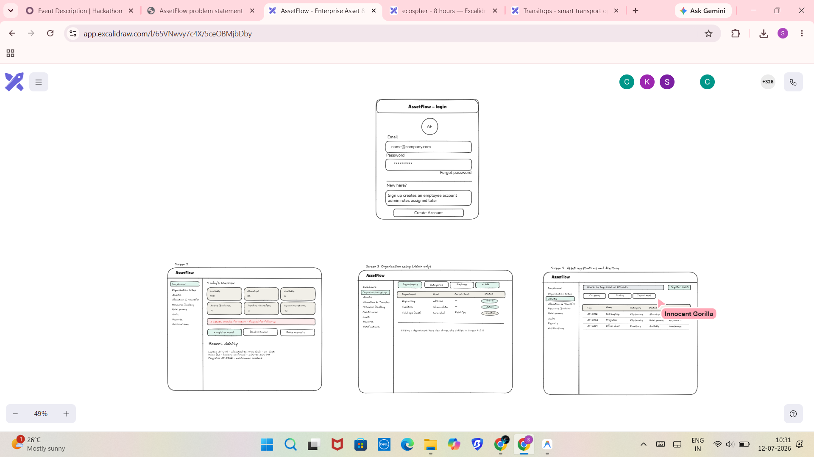
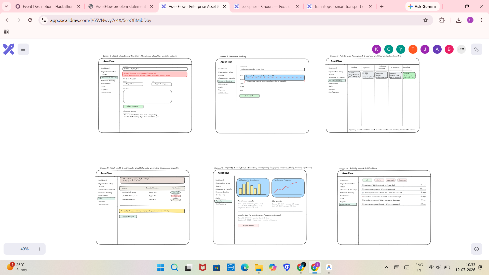
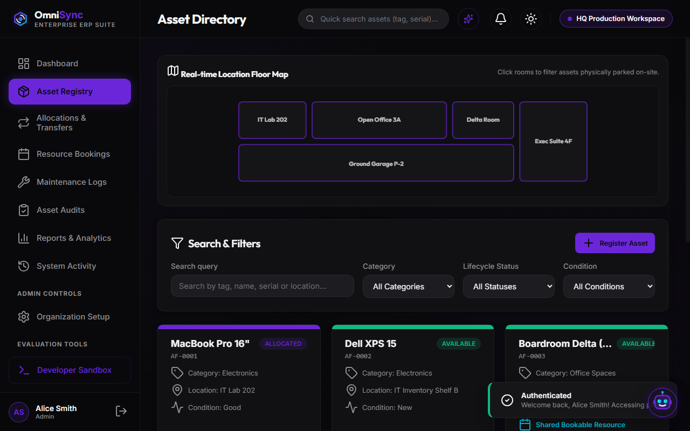
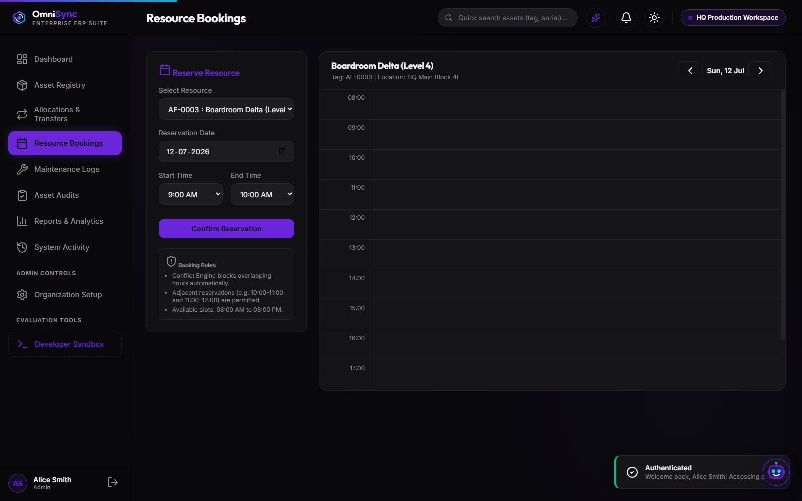
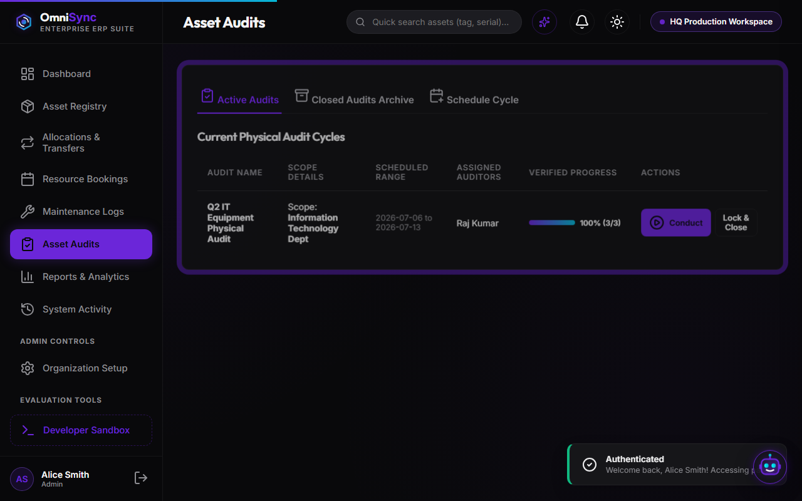
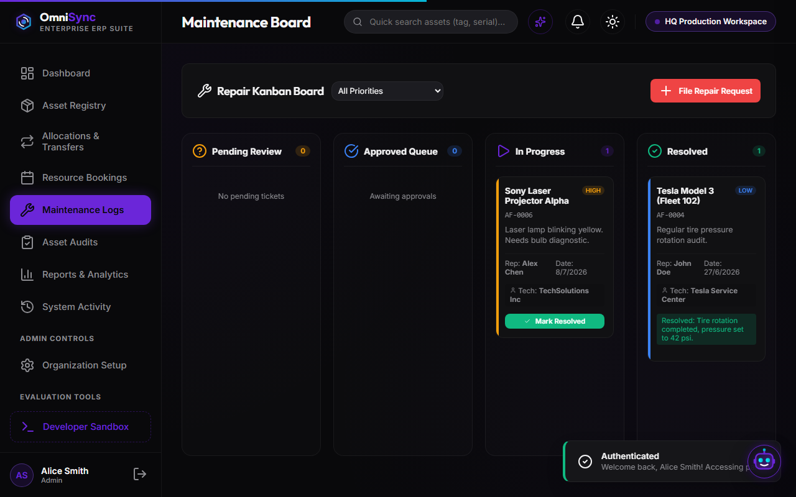

# ⚙️ OmniSync ERP — Enterprise Asset & Resource Management

[](https://shahsuraj0204.github.io/OneByte-odoo-hackathon-2026/)

[](https://github.com/)
[](https://github.com/)
[](https://github.com/)
[](https://github.com/)
[](https://github.com/)

**OmniSync** is a lightweight, high-performance, single-page application (SPA) Enterprise Resource Planning (ERP) platform designed to simplify how modern organizations track, allocate, and maintain physical assets and shared resources.

By focusing on a structured asset lifecycle, centralized booking, and real-time inspector verification cycles, OmniSync eliminates spreadsheet tracking inefficiencies and provides an intuitive, interactive environment for admins, managers, and employees.

---

## 📸 Project Visual Highlights

| Login Portal (Matte & Drifting Backdrop) | Workspace Dashboard Overview |
|:---:|:---:|
|  |  |

| Interactive Floor Plan Map | Central Booking Grid |
|:---:|:---:|
|  |  |

| Conduct Checklist & Certificate | Kanban Maintenance Logs |
|:---:|:---:|
|  |  |

---

## 💎 Key Premium Features

### 1. 🤖 Draggable AI Companion ("Syncie")
- **Floating SVG Robot Avatar**: Sits in the bottom-right corner of the screen, floating gently via CSS bounce cycles.
- **Parallax Drag Mechanics**: Fully draggable on desktop (mouse coordinates) and mobile devices (touch coordinates), letting users park the assistant anywhere on the screen.
- **Context-Sensitive Explanations**: Detects SPA routing shifts and automatically rewrites its advice to explain the page currently in view (e.g. explains the blueprint map on Assets, the booking bounds on Calendar, or discrepancies on Audits).

### 2. 🔍 Spotlight Command Center (Ctrl+K)
- **Alfred/Raycast Style Panel**: Pressing `Ctrl+K` triggers a high-speed keyboard-navigable command modal anywhere in the workspace.
- **Instant Actions**: Search for specific asset serials, navigate between tabs, fast-forward system date parameters, or run system-wide database integrity checks instantly.

### 3. 🗺️ Interactive Office Blueprint Map
- **Live SVG Floor Plan Layout**: The Asset Registry contains an inline vector blueprint of the corporate office.
- **Blueprint Zone Filtering**: Clicking on specific room blocks (IT Lab, Workspace, Boardroom Delta) filters the assets table in real-time, displaying only properties currently stored on-site.

### 4. 🖨️ Compliance Audit Print Overrides
- **Checklist Conductor**: Auditors can conducted scheduled cycles and flag items directly as OK, Faulty, or Lost.
- **Printable Certificate Compiler**: When audit cycles lock, the system compiles a discrepancy compliance summary. Click "Print PDF Certificate" to trigger a CSS print layout override, formatting a clean official inventory certificate fit for paper or PDF save.

### 5. 🎭 Role-Based Ambient Themes
- **Dynamic Accent Morphing**: The entire accent theme of the application (active sidebar highlights, borders, shadows, checkbox nodes, and charts) shifts colors dynamically based on the active role:
  - **Admin**: **Purple** (System administration).
  - **Asset Manager**: **Emerald Green** (Logistics & warehouse operations).
  - **Department Head**: **Teal/Cyan** (Group resource bookings).
  - **Employee**: **Electric Blue** (Self-service requests).
- **Ambient Corner Glow**: A subtle radial background gradient bloom drifts in the corners, transitioning HSL colors on-the-fly to indicate active clearance clearance levels.

### 6. ⏳ Time-Warp Sandbox Engine
- **Developer Simulator Drawer**: A slide-out panel on the right allows evaluators to shift the system date forward (+7 Days).
- **Dynamic Alerts**: Warping time automatically computes asset returns deadlines, raises overdue return alerts, and triggers system notifications.

---

## 🛠️ Technology Stack

- **Frontend Core**: Vanilla HTML5, modern HSL-driven CSS3 variables, and object-oriented Vanilla ES6 JavaScript Modules.
- **Routing**: Client-side hash-based Single Page App router (`app.js`).
- **Data Layer**: High-fidelity `localStorage` database seed simulator (`db.js`) equipped with cross-tab update events (`omnisync_db_update`) to sync edits across browser windows instantly.
- **Iconography**: Vector Lucide Icons.
- **Bundler & Server**: Vite.

---

## 💻 Installation & Local Setup

Ensure you have [Node.js](https://nodejs.org/) installed, then follow these steps:

1. **Clone the repository:**
   ```bash
   git clone https://github.com/YOUR_USERNAME/omnisync-erp.git
   cd omnisync-erp
   ```

2. **Install package dependencies:**
   ```bash
   npm install
   ```

3. **Start the development server locally:**
   ```bash
   npm run dev
   ```

4. **Build the production bundle:**
   ```bash
   npm run build
   ```

---

## 🔑 Demo Access Credentials

To test different role themes and interface accesses, use these seeded credentials on the login screen (or click the **Developer Sandbox** panel on the bottom left to swap roles instantly with one click):

| Profile Name | Role | Email | Password | Theme Accent |
| :--- | :--- | :--- | :--- | :--- |
| **Alice Smith** | Admin / Owner | `admin@omnisync.com` | `admin123` | **Purple** |
| **Sarah Connor** | Asset Manager | `manager@omnisync.com` | `manager123` | **Emerald Green** |
| **John Doe** | Department Head | `head@omnisync.com` | `head123` | **Teal / Cyan** |
| **Bob Johnson** | Standard Employee | `employee@omnisync.com` | `employee123` | **Electric Blue** |

---

## 📁 Repository Structure

```
├── index.html               # Main entry HTML template containing Sidebar, Topbar, & modals
├── package.json             # Dev server & lucide-icon build configurations
├── src/
│   ├── app.js               # Application router, keyboard hooks, & theme/autofill controllers
│   ├── db.js                # Synced LocalStorage database schema, seed data, & actions
│   ├── assets/              # Premium graphics asset assets (e.g. login_bg.png)
│   ├── styles/
│   │   ├── variables.css    # Color schemes, light/dark modes HSL tokens, sizing variables
│   │   └── main.css         # Layout cards, print overrides, & AI companion animation styling
│   └── views/
│       ├── loginView.js     # Floating auth screens
│       ├── dashboardView.js # Stats summaries & QR mock simulator modals
│       ├── assetsView.js    # Inventory listing & office map filters
│       ├── allocationView.js# Check-outs & swaps approval queues
│       ├── bookingView.js   # Central reservation calendars
│       ├── maintenanceView.js# Kanban drag repair tickets
│       ├── auditView.js     # Inspection checklists & printed certificate layouts
│       ├── reportsView.js   # Asset utilization density heatmaps
│       └── orgSetupView.js  # Company departments setup forms
```
